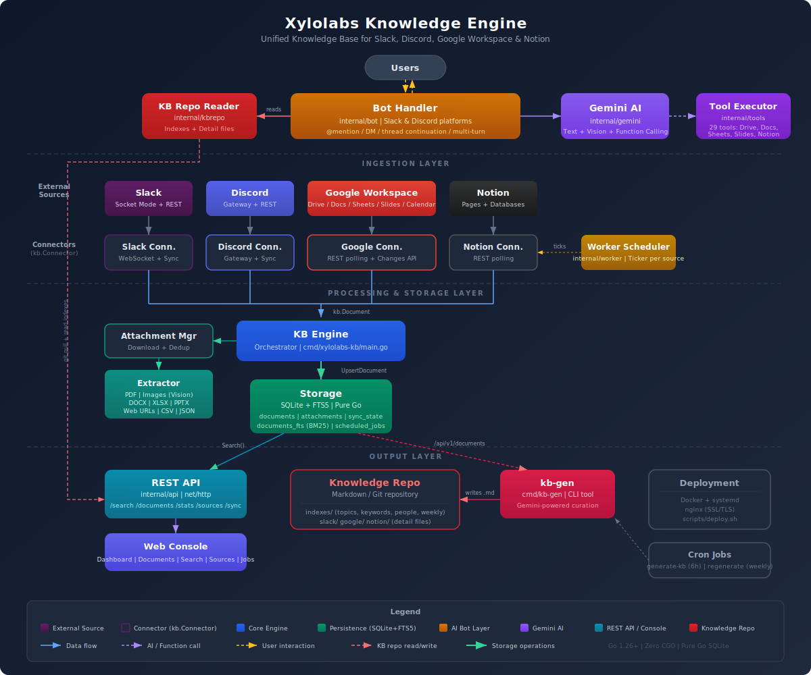

<div align="center">

# 🧠 Xylolabs Knowledge Engine

**Unified Knowledge Base Engine for Slack, Discord, Google Workspace & Notion**

[](https://go.dev)
[](LICENSE)
[](.)

*An always-on service that continuously ingests, indexes, and unifies organizational knowledge from Slack messages, Discord messages, Google Workspace documents, and Notion pages into a single searchable knowledge base — with AI-powered chat bots for Slack and Discord that answer questions grounded in your organization's data.*

---

</div>

## Features

- **Multi-platform bot interface** — @mention or DM the bot in Slack or Discord to ask questions, create documents, manage spreadsheets, build presentations, and organize files — all through natural conversation
- **Unified ingestion** — pulls content from Slack (messages, threads, files), Google Workspace (Docs, Sheets, Slides, Calendar, Drive files), and Notion (pages, databases) into one store
- **Full-text search** — SQLite FTS5 index with relevance scoring and snippet extraction across all sources
- **Markdown knowledge repo** — curated knowledge stored as structured markdown in a Git repository; the bot reads indexes hierarchically and fetches only relevant detail files
- **Incremental sync** — cursor-based sync state tracking per source; only fetches new or updated content on each pass
- **Real-time Slack events** — Socket Mode listener for immediate ingestion of new messages without polling
- **Real-time Discord events** — Discord gateway listener for immediate ingestion of new messages
- **Auto-join channels** — bot automatically joins all public channels and newly created channels
- **AI-powered bot** — @mention or DM the bot in Slack or Discord; answers are grounded in the markdown knowledge repo via Gemini AI with function calling support for Google Drive and Notion write operations. Responds in the user's language (English by default)
- **Google Calendar sync** — indexes calendar events (past 90 days to next 90 days) with attendees, location, and description
- **File content extraction** — automatically extracts text from PDFs, images (via Gemini vision), Office documents (DOCX/XLSX/PPTX), and web links during ingestion
- **Multi-modal understanding** — images and PDFs attached to Slack messages or Google Drive are processed with AI for text extraction and description
- **Attachment management** — downloads and locally stores file attachments with MIME type tracking and size accounting
- **Structured metadata** — preserves author, channel/workspace, parent threading, content type, and timestamps for every document
- **REST API** — HTTP endpoints for search, document retrieval, sync status, and statistics
- **Graceful shutdown** — SIGINT/SIGTERM handling ensures in-flight syncs complete cleanly
- **Zero CGO dependency** — uses `modernc.org/sqlite` (pure Go) for easy cross-compilation
- **Configurable via environment** — all settings driven by environment variables; no config files required
- **Docker-ready** — multi-stage Dockerfile with non-root user and health check

## Architecture

<p align="center">
  
</p>

**Data flow:**

1. Each connector runs on its own goroutine — Slack via Socket Mode (push), Google and Notion via periodic polling
2. Connectors emit `Document` values (with optional `Attachment` slices) to the KB engine
3. The engine calls `Storage.UpsertDocument` which writes to SQLite (temporary raw storage)
4. A separate KB generation process (`kb-gen`) curates raw documents into structured markdown and pushes to a Git knowledge repo
5. The Slack bot reads the markdown knowledge repo hierarchically — loading indexes first, then only relevant detail files matching the query
6. The REST API layer reads directly from `Storage` for raw document search

## Quickstart for Agents

> Paste this prompt into [Claude Code](https://claude.com/claude-code), [OpenCode](https://github.com/nicepkg/opencode), [Codex](https://github.com/openai/codex), or any AI coding agent.

```
Set up Xylolabs Knowledge Engine from https://github.com/xylolabsinc/Xylolabs-Knowledge-Engine

1. Clone the repo and cd into it
2. Copy .env.example to .env
3. Ask me for the following credentials (do NOT make up placeholder values):
   - SLACK_BOT_TOKEN (xoxb-...)
   - SLACK_APP_TOKEN (xapp-...)
   - SLACK_SIGNING_SECRET
   - GOOGLE_CREDENTIALS_FILE path (OAuth2 or service account JSON)
   - NOTION_API_KEY (ntn_...)
   - DISCORD_BOT_TOKEN (bot token from Discord Developer Portal)
   - DISCORD_GUILD_ID (server ID)
   - GEMINI_API_KEY
4. Fill in .env with the values I provide. Leave unconfigured connectors empty — they auto-disable.
5. Run `make build` to compile (requires Go 1.26+, no CGO needed)
6. Run `make run` to start the service
7. Verify: curl http://localhost:8080/health should return {"status":"ok"}

The Slack bot is the main interface. Once running, @mention the bot in Slack to ask questions.
For Google Workspace: the bot needs OAuth2 consent on first run — watch stdout for the auth URL.
For Docker deployment: `make docker` instead of steps 5-6.
Read docs/datasource-setup-guide.md for detailed credential setup per provider.
```

## Slowstart for Humans

### Prerequisites

| Requirement | Version |
|-------------|---------|
| Go | 1.26+ |
| SQLite (via `modernc.org/sqlite`) | bundled — no system install needed |
| Docker & Docker Compose | optional, for containerised deployment |

### 1. Clone & Configure

```bash
git clone https://github.com/xylolabsinc/Xylolabs-Knowledge-Engine.git
cd Xylolabs-Knowledge-Engine

cp .env.example .env
```

### 2. Add Credentials

Open `.env` and fill in the credentials for the connectors you want to enable. Connectors auto-enable when credentials are present — no flags needed.

| Connector | Required Credentials | Setup Guide |
|-----------|---------------------|-------------|
| **Slack** | `SLACK_BOT_TOKEN`, `SLACK_APP_TOKEN` | [Slack setup](docs/datasource-setup-guide.md) |
| **Discord** | `DISCORD_BOT_TOKEN`, `DISCORD_GUILD_ID` | [Discord setup](#discord) |
| **Google Workspace** | `GOOGLE_CREDENTIALS_FILE` (OAuth2 JSON on disk) | [Google setup](docs/datasource-setup-guide.md) |
| **Notion** | `NOTION_API_KEY` | [Notion setup](docs/datasource-setup-guide.md) |
| **Gemini AI** (for bot) | `GEMINI_API_KEY` | [Google AI Studio](https://aistudio.google.com/) |

### 3. Build & Run

```bash
# Native
make build
make run

# Or with Docker
make docker
```

### 4. Verify

```bash
curl http://localhost:8080/health
# {"status":"ok","time":"..."}
```

### 5. Talk to the Bot

The **Slack bot is the main interface**. @mention it in any channel or send a DM to start asking questions about your organization's knowledge.

> **First-time Google OAuth:** On first run, the service prints an authorization URL to stdout. Open it in a browser, grant access, and the token is cached for future runs.

## Configuration

All configuration is via environment variables. Copy `.env.example` to `.env` to get started.

> **Note:** Connectors are auto-enabled based on credential presence — there are no explicit `*_ENABLED` flags. See each connector section below for details.

### General

| Variable | Description | Default |
|----------|-------------|---------|
| `LOG_LEVEL` | Log verbosity: `debug`, `info`, `warn`, `error` | `info` |
| `DB_PATH` | Path to the SQLite database file | `xylolabs-kb.db` |
| `ATTACHMENT_PATH` | Directory for downloaded attachment files | `attachments` |
| `KB_REPO_DIR` | Path to the markdown knowledge base Git repository | — |

### API Server

| Variable | Description | Default |
|----------|-------------|---------|
| `API_HOST` | Interface to bind the HTTP server | `0.0.0.0` |
| `API_PORT` | Port for the HTTP REST API | `8080` |

### Slack

| Variable | Description | Default |
|----------|-------------|---------|
| `SLACK_BOT_TOKEN` | Bot User OAuth Token (`xoxb-...`) | — |
| `SLACK_APP_TOKEN` | App-Level Token for Socket Mode (`xapp-...`) | — |
| `SLACK_SIGNING_SECRET` | Signing secret for request verification | — |
| `SLACK_SYNC_INTERVAL` | How often to run a full sync pass | `5m` |

Slack is auto-enabled when both `SLACK_BOT_TOKEN` and `SLACK_APP_TOKEN` are set.

> **Note:** `.env.example` may set `SLACK_SYNC_INTERVAL=60s` for faster iteration during development; the code default is `5m`.

### Discord

| Variable | Description | Default |
|----------|-------------|---------|
| `DISCORD_BOT_TOKEN` | Discord Bot Token from Developer Portal | — |
| `DISCORD_GUILD_ID` | Discord Server (Guild) ID | — |
| `DISCORD_SYNC_INTERVAL` | How often to run a full sync pass | `5m` |

Discord is auto-enabled when both `DISCORD_BOT_TOKEN` and `DISCORD_GUILD_ID` are set.

> **Note:** The **MESSAGE_CONTENT** privileged gateway intent must be enabled in the [Discord Developer Portal](https://discord.com/developers/applications) for the bot to read message text.

### Google Workspace

| Variable | Description | Default |
|----------|-------------|---------|
| `GOOGLE_CREDENTIALS_FILE` | Path to OAuth2 or service account key JSON | `credentials.json` |
| `GOOGLE_TOKEN_FILE` | Path to store the OAuth2 token cache | `token.json` |
| `GOOGLE_SYNC_INTERVAL` | How often to poll for changes | `15m` |
| `GOOGLE_DRIVE_FOLDERS` | Comma-separated Drive folder IDs to index (empty = all accessible) | — |

Google is auto-enabled when `GOOGLE_CREDENTIALS_FILE` exists on disk.

### Notion

| Variable | Description | Default |
|----------|-------------|---------|
| `NOTION_API_KEY` | Notion Internal Integration Token (`ntn_...`) | — |
| `NOTION_SYNC_INTERVAL` | How often to poll for changes | `10m` |
| `NOTION_ROOT_PAGES` | Comma-separated root page IDs to index | — |

Notion is auto-enabled when `NOTION_API_KEY` is set.

### Gemini AI

| Variable | Description | Default |
|----------|-------------|---------|
| `GEMINI_API_KEY` | Google Gemini API key for bot responses and image description | — |
| `GEMINI_MODEL` | Gemini model to use | `gemini-3.1-flash-lite-preview` |

### KB Generation (Go tool: `kb-gen`)

The `kb-gen` CLI tool reads its configuration from flags and environment variables.

| Variable | Description | Default |
|----------|-------------|---------|
| `GEMINI_API_KEY` | API key used by the Go `kb-gen` tool | — |
| `KB_GEN_MODEL` | Gemini model for KB generation | `gemini-3.1-pro-preview` |
| `KB_GEN_THINKING` | Thinking level: `none`, `low`, `medium`, `high` | `high` |

### Scripts

The shell scripts in `scripts/` use their own set of environment variables (not shared with `config.go`).

| Variable | Description | Default |
|----------|-------------|---------|
| `API_BASE` | Go worker API base URL | `http://localhost:8080` |
| `KB_REPO_DIR` | Path to knowledge repo | `/opt/knowledge` |
| `KB_BACKEND` | Processing backend: `gemini` or `claude` | `gemini` |
| `KB_GEN_MODEL` | Gemini model for KB generation | `gemini-3.1-pro-preview` |
| `KB_GEN_THINKING` | Thinking level: `none`, `low`, `medium`, `high` | `high` |
| `KB_GEN_API_KEY` | API key for KB generation | `$GEMINI_API_KEY` |
| `MAX_DOCS_PER_SOURCE` | Max documents per fetch | `500` |
| `CLAUDE_MODEL` | Claude model for fallback | `claude-opus-4-6` |

## API Reference

The REST API is served on `http://{API_HOST}:{API_PORT}` (default `http://localhost:8080`).

All endpoints except `/health` are prefixed with `/api/v1/`.

### Health Check

```bash
GET /health
```

```bash
curl http://localhost:8080/health
# {"status":"ok","time":"2025-12-01T09:00:00Z"}
```

### Search

```bash
GET /api/v1/search?q={query}&source={source}&channel={channel}&author={author}&from={RFC3339}&to={RFC3339}&limit={n}&offset={n}
```

| Parameter | Type | Description |
|-----------|------|-------------|
| `q` | string | Full-text search query (required) |
| `source` | string | Filter by source: `slack`, `discord`, `google`, `notion` |
| `channel` | string | Filter by channel or workspace |
| `author` | string | Filter by author name or email |
| `from` | RFC3339 | Filter documents after this timestamp |
| `to` | RFC3339 | Filter documents before this timestamp |
| `limit` | int | Max results (default 20, max 100) |
| `offset` | int | Pagination offset |

```bash
curl "http://localhost:8080/api/v1/search?q=deployment+runbook&source=notion&limit=5"
```

```json
{
  "query": "deployment runbook",
  "results": [
    {
      "id": "doc_abc123",
      "source": "notion",
      "title": "Deployment Runbook",
      "snippet": "...the <b>deployment runbook</b> covers all production steps...",
      "content_type": "page",
      "author": "alice@example.com",
      "channel": "",
      "url": "https://notion.so/...",
      "timestamp": "2025-11-01T09:00:00Z",
      "score": 4.72
    }
  ],
  "total": 1,
  "limit": 5,
  "offset": 0
}
```

### List Documents

```bash
GET /api/v1/documents?source={source}&since={RFC3339}&limit={n}&offset={n}
```

| Parameter | Type | Description |
|-----------|------|-------------|
| `source` | string | Filter by source: `slack`, `discord`, `google`, `notion` |
| `since` | RFC3339 | Only documents indexed after this timestamp |
| `limit` | int | Max results (default 500, max 1000) |
| `offset` | int | Pagination offset |

Used by `kb-gen` to export raw documents for knowledge base generation.

### Get Document

```bash
GET /api/v1/documents/{id}
```

```bash
curl http://localhost:8080/api/v1/documents/doc_abc123
```

### Sources

```bash
GET /api/v1/sources
```

Returns status information for each configured sync source.

```bash
curl http://localhost:8080/api/v1/sources
```

```json
{
  "sources": [
    {
      "name": "slack",
      "interval": "5m0s",
      "last_run": "2025-12-01T14:32:00Z",
      "run_count": 42,
      "err_count": 0,
      "last_sync": "2025-12-01T14:32:00Z",
      "cursor": "1733058720.000000"
    }
  ]
}
```

### Trigger Manual Sync

```bash
POST /api/v1/sync/{source}
```

Forces an immediate sync pass for the given source (`slack`, `google`, `notion`). Returns HTTP 202 Accepted.

```bash
curl -X POST http://localhost:8080/api/v1/sync/notion
# {"status":"sync triggered","source":"notion"}
```

### Statistics

```bash
GET /api/v1/stats
```

```bash
curl http://localhost:8080/api/v1/stats
```

```json
{
  "total_documents": 18420,
  "documents_by_source": {
    "slack": 15200,
    "google": 1800,
    "notion": 1420
  },
  "documents_by_type": {
    "message": 14900,
    "page": 1420,
    "document": 900,
    "spreadsheet": 900,
    "file": 300
  },
  "total_attachments": 842,
  "attachment_size": 2147483648,
  "last_sync_times": {
    "slack": "2025-12-01T14:32:00Z",
    "notion": "2025-12-01T14:30:00Z",
    "google": "2025-12-01T14:28:00Z"
  }
}
```

## Web Console

The Knowledge Engine includes a built-in web console for monitoring and exploring your knowledge base.

### Features

- **Dashboard** — Overview statistics: total document counts, attachment storage usage, sync status for each source
- **Documents** — Directory-style browser to navigate documents organized by source and channel with breadcrumb navigation
- **Search** — Full-text search with filters by source, channel, and author
- **Sources** — Sync status monitoring for Slack, Google Workspace, and Notion with manual sync triggers
- **Jobs** — View scheduled message jobs and execution history
- **Index** — Hierarchical tree view of all documents organized by source, channel, and thread

### Access

The console is available at:

- **Local development:** `http://localhost:8080/console`
- **Production:** `https://your-domain/console`

### Authentication

Password protection is optional and configured via environment variables:

```bash
CONSOLE_USERNAME=admin                    # Default username
CONSOLE_PASSWORD=yourpassword             # Leave empty to disable authentication
```

If `CONSOLE_PASSWORD` is empty, the console is publicly accessible without authentication.

### URL Routing

The console uses hash-based routing for shareable, bookmarkable URLs:

| URL | View |
|-----|------|
| `/console#tab/dashboard` | Dashboard with stats |
| `/console#tab/search` | Full-text search |
| `/console#docs/slack` | Browse all Slack documents |
| `/console#docs/slack/general` | Browse documents in #general channel |
| `/console#docs/google/drive` | Browse Google Drive documents |
| `/console#doc/{id}` | View specific document details |
| `/console#tab/sources` | Sync status and manual triggers |
| `/console#tab/jobs` | Scheduled jobs view |
| `/console#tab/index` | Hierarchical document index |

### Production Deployment with Nginx

A production nginx configuration is included at `configs/nginx-xylolabs-kb.conf` with:

- **SSL/TLS** — Automatic certificate management via Let's Encrypt (certbot)
- **Rate limiting** — Protects login endpoints (5 requests/minute) and API (30 requests/second)
- **Security headers** — X-Frame-Options, X-Content-Type-Options, Strict-Transport-Security
- **Caching** — Appropriate cache headers for static assets and API responses

To deploy with nginx:

```bash
./scripts/deploy.sh --with-nginx
```

This will:
1. Build the Go binary for linux/arm64
2. Upload to the OCI server
3. Copy the nginx configuration to `/etc/nginx/sites-available/`
4. Enable the site and reload nginx
5. Verify the service is healthy

## Chat Bot

The Knowledge Engine provides AI-powered chat bots for **Slack** and **Discord**. When `GEMINI_API_KEY` is set and the respective platform is enabled, the bot responds to:

- **@mentions** — mention the bot in any channel and ask a question
- **Direct messages** — send the bot a DM
- **Thread replies** — once the bot responds in a thread, subsequent messages are handled automatically

### Platform-Specific Formatting

| Feature | Slack | Discord |
|---------|-------|---------|
| Bold | `*bold*` (mrkdwn) | `**bold**` (Markdown) |
| Links | `<url\|text>` (mrkdwn) | `[text](url)` (Markdown) |
| Headers | `*Header*` (bold) | `## Header` (native) |
| Message limit | 3,000 chars/block | 2,000 chars/message |
| Reactions | Native Slack emoji | Unicode emoji mapping |
| File upload | `files:write` scope | Direct CDN upload |

The bot:
1. Extracts the question from the message
2. Pulls the latest markdown knowledge repo (`git pull`)
3. Loads index files (topics, keywords, people, weekly summaries)
4. Finds relevant detail files via keyword matching in index sections
5. Builds context from indexes + top 10 relevant detail files
6. Calls Gemini API with the context + question + any attached images/PDFs
7. Replies in the same thread
8. Responds in the user's language (English by default)

### Additional Bot Capabilities

- **Tool calling (function calling)** — 29 tools for Google Workspace and Notion operations via Gemini function calling:
  - **Google Drive:** `search_drive`, `get_drive_file_info`, `create_drive_folder`, `upload_to_drive`, `delete_drive_file`, `rename_drive_file`, `move_drive_file`, `copy_drive_file`, `list_drive_folder`, `share_drive_file`, `export_as_pdf`
  - **Google Docs:** `create_google_doc`, `read_google_doc`, `edit_google_doc`, `append_to_google_doc`
  - **Google Sheets:** `read_google_sheet`, `create_google_sheet`, `edit_google_sheet`, `append_google_sheet`, `get_sheet_metadata`, `clear_google_sheet`, `add_sheet_tab`
  - **Google Slides:** `read_google_slides`, `create_google_slides`, `add_slide`, `delete_slide`
  - **Notion:** `create_notion_page`, `update_notion_page`
- **Thread continuation** — once the bot replies in a thread, all subsequent messages in that thread are handled automatically (no @mention needed)
- **Multi-turn conversations** — up to 20 prior messages from the thread are included as context for conversation continuity
- **Bidirectional learning** — when users share factual information, the bot can save it to the knowledge repo via LEARN blocks
- **Business document lookup** — the bot provides exact values for business registration numbers, corporate registration numbers, representative names, etc., with links to original documents
- **Slack mrkdwn formatting** — responses use native Slack formatting (not Markdown)
- **Reply truncation** — responses are capped at 3,000 characters

### Required Additional Slack Bot Scopes

| Scope | Purpose |
|-------|---------|
| `app_mentions:read` | Detect when users @mention the bot |
| `chat:write` | Post replies to channels |
| `files:read` | Read file attachments sent to the bot |
| `files:write` | Upload screenshots and files to channels |
| `im:history` | Read DM messages |
| `im:read` | Access DM channels |
| `im:write` | Send DM replies |

### File Content Extraction

When files are shared in Slack channels or uploaded to Google Drive, the system automatically extracts text content:

| File Type | Method |
|-----------|--------|
| PDF | Pure-Go text extraction |
| Images (PNG, JPG, etc.) | Gemini vision AI description |
| DOCX | XML parsing from ZIP archive |
| XLSX | Spreadsheet cell extraction |
| PPTX | Slide text extraction |
| Web URLs | Article extraction (readability) |
| Text files | Direct read |

---

## Data Sources

### Slack

**Required OAuth Bot Token Scopes:**

| Scope | Purpose |
|-------|---------|
| `channels:history` | Read public channel messages |
| `channels:join` | Auto-join public channels |
| `channels:read` | List public channels |
| `groups:history` | Read private channel messages (if invited) |
| `groups:read` | List private channels |
| `files:read` | Download shared files |
| `files:write` | Upload screenshots and files to channels |
| `users:read` | Resolve user display names |
| `users:read.email` | Resolve user emails |

**App-Level Token Scopes (Socket Mode):**

| Scope | Purpose |
|-------|---------|
| `connections:write` | Open WebSocket connections |

**Setup steps:**

1. Go to [api.slack.com/apps](https://api.slack.com/apps) and create a new app
2. Under **OAuth & Permissions**, add all Bot Token Scopes listed above
3. Under **Socket Mode**, enable Socket Mode and generate an App-Level Token with `connections:write`
4. Under **Event Subscriptions**, subscribe to: `app_mention`, `message.channels`, `message.groups`, `message.im`, `channel_created`
5. Install the app to your workspace and copy the Bot User OAuth Token (`xoxb-...`)
6. Set `SLACK_BOT_TOKEN`, `SLACK_APP_TOKEN`, and `SLACK_SIGNING_SECRET` in your `.env`

The bot automatically joins all public channels during each sync cycle and new channels in real-time via the `channel_created` event.

### Discord

**Required Bot Permissions:**

| Permission | Purpose |
|-----------|---------|
| Send Messages | Post bot replies |
| Read Message History | Historical message sync |
| Add Reactions | Emoji reactions on messages |
| Attach Files | Upload screenshots and files |

**Required Privileged Gateway Intents:**

| Intent | Purpose |
|--------|---------|
| MESSAGE_CONTENT | Read message text content |
| GUILD_MESSAGES | Receive message events in servers |
| DIRECT_MESSAGES | Receive DM events |

**Setup steps:**

1. Go to [Discord Developer Portal](https://discord.com/developers/applications) and create a new application
2. Under **Bot**, create a bot user and copy the **Token** — set as `DISCORD_BOT_TOKEN`
3. Under **Bot > Privileged Gateway Intents**, enable **MESSAGE CONTENT INTENT**
4. Under **OAuth2 > URL Generator**, select scopes: `bot`, `applications.commands`
5. Select bot permissions: Send Messages, Read Message History, Add Reactions, Attach Files
6. Copy the generated invite URL and open it to add the bot to your server
7. Right-click your server name → Copy Server ID — set as `DISCORD_GUILD_ID`

> **Tip:** To copy the Server ID, enable Developer Mode in Discord settings (User Settings → App Settings → Advanced → Developer Mode).

### Google Workspace

The connector supports both **OAuth2** (for user-delegated access) and **Service Account** (for domain-wide delegation in Google Workspace organizations).

**Required API scopes:**

| Scope | Purpose |
|-------|---------|
| `https://www.googleapis.com/auth/drive` | List, read, and write Drive files |
| `https://www.googleapis.com/auth/documents` | Read and write Google Docs content |
| `https://www.googleapis.com/auth/spreadsheets` | Read and write Google Sheets content |
| `https://www.googleapis.com/auth/presentations` | Read and write Google Slides content |
| `https://www.googleapis.com/auth/calendar.readonly` | Read Google Calendar events |

**Setup steps (OAuth2):**

1. In [Google Cloud Console](https://console.cloud.google.com), create or select a project
2. Enable the **Google Drive API**, **Google Docs API**, and **Google Sheets API**
3. Under **APIs & Services > Credentials**, create an OAuth 2.0 Client ID (Desktop application)
4. Download the credentials JSON and set `GOOGLE_CREDENTIALS_FILE` to its path
5. On first run, the bot will print an authorization URL — open it, grant access, and the token is saved to `GOOGLE_TOKEN_FILE`

**Setup steps (Service Account):**

1. Create a Service Account under **IAM & Admin > Service Accounts**
2. Grant it domain-wide delegation and add the scopes above in the Google Workspace Admin Console
3. Download the service account key JSON and set `GOOGLE_CREDENTIALS_FILE` to its path

### Notion

**Setup steps:**

1. Go to [notion.so/my-integrations](https://www.notion.so/my-integrations) and click **New integration**
2. Give it a name, select your workspace, and set **Capabilities** to read content
3. Copy the **Internal Integration Token** (`ntn_...`) and set `NOTION_API_KEY`
4. For each page or database you want indexed, open it in Notion, click **...** (top right), go to **Connections**, and add your integration
5. Set `NOTION_ROOT_PAGES` to a comma-separated list of the root page IDs you want crawled

## Storage

xylolabs-kb uses **SQLite** with the **FTS5** extension for full-text search.

### Schema overview

**`documents` table** — primary store for all ingested content:

| Column | Type | Description |
|--------|------|-------------|
| `id` | TEXT PRIMARY KEY | Internal UUID |
| `source` | TEXT | `slack`, `discord`, `google`, or `notion` |
| `source_id` | TEXT | Original ID in the source system |
| `parent_id` | TEXT | Parent document ID (for threads/hierarchy) |
| `title` | TEXT | Document title or message preview |
| `content` | TEXT | Full text content |
| `content_type` | TEXT | `message`, `file`, `page`, `document`, `spreadsheet` |
| `author` | TEXT | Display name of author |
| `author_email` | TEXT | Email of author |
| `channel` | TEXT | Channel, folder, or database name |
| `workspace` | TEXT | Workspace or organization name |
| `url` | TEXT | Deep link to original content |
| `timestamp` | DATETIME | Content creation time |
| `updated_at` | DATETIME | Last modification time in source |
| `indexed_at` | DATETIME | When the record was last written |
| `metadata` | TEXT (JSON) | Source-specific extra fields |

**`attachments` table** — downloaded files:

| Column | Type | Description |
|--------|------|-------------|
| `id` | TEXT PRIMARY KEY | Internal UUID |
| `document_id` | TEXT | FK to `documents.id` |
| `filename` | TEXT | Original filename |
| `mime_type` | TEXT | MIME type |
| `size` | INTEGER | File size in bytes |
| `source_url` | TEXT | Original download URL |
| `local_path` | TEXT | Path on local filesystem |
| `downloaded_at` | DATETIME | Download timestamp |

**`documents_fts` virtual table** — FTS5 index over `title` and `content` with BM25 ranking.

**`sync_state` table** — per-source sync cursors:

| Column | Type | Description |
|--------|------|-------------|
| `source` | TEXT PRIMARY KEY | Source identifier |
| `last_sync_at` | DATETIME | Timestamp of last successful sync |
| `cursor` | TEXT | Source-specific pagination cursor |
| `metadata` | TEXT (JSON) | Additional sync metadata |

**`scheduled_jobs` table** — scheduled and recurring message jobs:

| Column | Type | Description |
|--------|------|-------------|
| `platform` | TEXT | Target platform: `slack` or `discord` (default: `slack`) |

### FTS5 search capabilities

- BM25 relevance ranking
- Snippet extraction with highlighted match terms
- Phrase queries (`"deployment runbook"`), prefix queries (`deploy*`), and boolean operators (`deploy AND runbook`)
- Column filters — search only `title` or only `content`

## Scripts

```
scripts/
├── deploy.sh          # Build + upload + restart on OCI server
├── generate-kb.sh     # Incremental KB generation (cron job)
└── regenerate-kb.sh   # Full KB rebuild (weekly)
```

**`scripts/deploy.sh`** — Builds Go binaries for linux/arm64, uploads to the OCI server, restarts the systemd service, and verifies health.

```bash
./scripts/deploy.sh              # Build, upload, restart
./scripts/deploy.sh --with-env   # Also upload .env
./scripts/deploy.sh --with-cron  # Also install crontab
```

**`scripts/generate-kb.sh`** — Fetches new documents from the Go worker API, invokes `kb-gen` (Gemini) to transform them into structured markdown, and commits to the knowledge repo. Falls back to Claude Code CLI if Gemini quota is exhausted.
- Runs as a cron job every 6 hours
- Configurable via: `KB_BACKEND`, `KB_GEN_MODEL`, `KB_GEN_THINKING`, `KB_GEN_API_KEY`, `MAX_DOCS_PER_SOURCE`

**`scripts/regenerate-kb.sh`** — Full rebuild: resets sync state to epoch and runs `generate-kb.sh` iteratively (up to 10 times). Scheduled weekly (Sunday 3 AM).

## Docker

### docker-compose.yml

```bash
# Start
docker compose up -d

# View logs
docker compose logs -f xylolabs-kb

# Stop
docker compose down
```

Volumes:
- `kb-data` (Docker-managed named volume) mounted at `/data` — SQLite database and attachment storage (persisted across container restarts)

Log rotation is configured with the `json-file` driver (max-size 50m, max-file 5).

The service exposes port `8080` by default.

> **Note:** The Dockerfile builds for `linux/amd64`. For ARM64 deployments (e.g., Oracle Cloud ARM instances), use `scripts/deploy.sh` which builds natively for `linux/arm64`.

## Development

### Building

```bash
make build        # produces bin/xylolabs-kb
make run          # build + run
make test         # go test -race ./...
make test-coverage # generate coverage.html
make lint         # go vet + staticcheck
make clean        # remove build artifacts
```

### Running tests

```bash
# All unit tests
go test ./...

# Single package
go test ./internal/storage/...

# With race detector
go test -race ./...

# Integration tests (require live credentials)
go test -tags integration ./...
```

### Project conventions

- All logging via `log/slog` — never `fmt.Println`
- Context propagation on every I/O call
- Error wrapping: `fmt.Errorf("component: action: %w", err)`
- Prepared statements for all SQL queries
- Rate limit every outbound API call
- Table-driven tests

### Adding a new connector

1. Create `internal/{source}/connector.go` implementing `kb.Connector`
2. Add a `Source` constant to `internal/kb/types.go`
3. Wire it up in `cmd/xylolabs-kb/main.go`
4. Add environment variables to `.env.example` and document them in this README

## Project Structure

```
xylolabs-kb/
├── cmd/
│   └── xylolabs-kb/
│       └── main.go          # Entry point — wires connectors, storage, API, worker
│   └── kb-gen/
│       └── main.go          # Gemini-powered KB generation tool
├── internal/
│   ├── kb/
│   │   └── types.go         # Core domain types, Storage interface, Connector interface
│   ├── storage/             # SQLite + FTS5 implementation of kb.Storage
│   ├── slack/               # Slack connector (Socket Mode + periodic sync)
│   ├── discord/             # Discord connector (Gateway + periodic sync)
│   ├── google/              # Google Workspace connector (Drive, Docs, Sheets, Slides, Calendar)
│   ├── notion/              # Notion connector (pages, databases)
│   ├── bot/                 # Platform-agnostic bot handler (Slack + Discord)
│   ├── tools/               # Tool executor for write operations (Google Drive, Notion)
│   ├── kbrepo/              # Hierarchical markdown KB repo reader
│   ├── gemini/              # Gemini API client (with function calling support)
│   ├── extractor/           # Content extraction (PDF, images, office docs, web)
│   ├── attachment/          # File download manager
│   ├── worker/              # Background sync scheduler
│   ├── config/              # Configuration management
│   └── api/                 # HTTP REST API handlers
├── scripts/
│   ├── deploy.sh            # Deployment automation
│   ├── generate-kb.sh       # Incremental KB generation
│   └── regenerate-kb.sh     # Full KB rebuild
├── configs/
│   └── xylolabs-kb.service  # systemd service file
├── docs/
│   ├── architecture.md      # Detailed architecture documentation
│   ├── slack-bot.md         # Slack bot setup and usage guide
│   └── setup.md             # Step-by-step setup guide
├── data/                    # Runtime data (gitignored)
│   ├── xylolabs-kb.db       # SQLite database
│   └── attachments/         # Downloaded attachment files
├── .env.example             # Template environment configuration
├── .gitignore
├── Dockerfile               # Multi-stage build
├── docker-compose.yml
├── go.mod
├── Makefile
└── README.md
```
